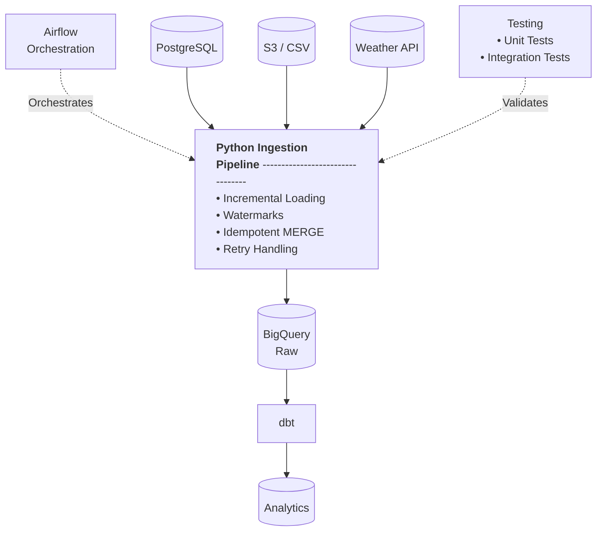

# E-commerce Data Platform

A production-style data engineering platform that ingests e-commerce and external data from multiple sources into BigQuery, with incremental and idempotent loading, automated retries, failure alerting, and dbt-based transformations.

## Key Engineering Features

- **Incremental ingestion** using source-specific watermarks
- **Idempotent loading** using BigQuery `MERGE` operations
- **Retry handling** for transient PostgreSQL, BigQuery, and API failures
- **Data validation and cleaning** for incoming datasets
- **Unit and integration tests**
- **Airflow orchestration** for pipeline execution
- **Structured logging** for pipeline observability

## Architecture



## Data Ingestion Sources

The platform brings together data from three different sources, each representing a different part of the business: transactional data from an OLTP database, marketing data delivered as CSV files through cloud object storage, and external weather data from a public API.

1. **PostgreSQL**  
   Primary OLTP database containing transactional e-commerce data across orders, customers, stores, products, and order items.

2. **Amazon S3 (Marketing Campaign Files)**  
   Cloud object storage containing CSV files with marketing campaign information, budgets, spend, channels, and dates.

3. **Weather API**  
   External API providing historical weather observations for selected cities, adding environmental context to sales data and enabling analysis of how weather conditions may influence purchases and customer behavior.

## Pipeline Design

The ingestion pipeline is built around three core principles:

1. **Incremental Loading**  
   The pipeline tracks a watermark for each source table and uses it to determine which records need to be extracted during subsequent runs.

   This avoids repeatedly processing the entire source dataset.

2. **Idempotent Loading**  
   Incoming records are loaded into temporary BigQuery tables and merged into the target tables using their natural keys.

   This allows the same data to be safely processed multiple times without creating duplicate records.

3. **Retry Handling**  
   Transient failures are retried using exponential backoff.

   Retryable errors are defined separately for the different external systems rather than retrying every exception indiscriminately.

## Data Warehouse Design

The BigQuery warehouse is organized into three layers, separating source data from analytical models:

1. **Raw**  
   Contains data ingested directly from the source systems with minimal transformation, preserving the source data for downstream processing.

2. **Staging**  
   Contains lightweight dbt models that select the required columns from the Raw layer and provide a consistent foundation for downstream analytical modeling.

3. **Analytics**  
   Contains business-ready models organized using a **star schema**, with fact and dimension tables designed for analytical queries and reporting. The models combine e-commerce, marketing, and weather data to support analysis of purchases and customer behavior.

## Data Transformation

The transformation layer is built with **dbt**, converting the raw and staged data into analytical models organized around a star schema.

1. **Staging Models**  
   Lightweight models that select the required columns from the Raw layer and provide a consistent interface for downstream transformations.

2. **Fact and Dimension Models**  
   Analytical models are organized using a **star schema**, separating measurable business events into fact tables from descriptive attributes in dimension tables.

3. **Data Quality Tests**
Custom dbt tests validate business rules and data quality assumptions, including campaign date ranges, campaign spending limits, and invalid or future order dates.

## Testing & Data Quality

The platform uses automated tests to verify ingestion behavior and data quality across the pipeline.

1. **Python Unit Tests**  
   Unit tests cover core ingestion logic, including incremental loading, BigQuery `MERGE` operations, and retry behavior.

2. **Python integration tests**  
   Python integration tests execute against an isolated BigQuery `test` dataset, allowing the ingestion pipeline to be tested against real BigQuery operations without affecting production warehouse data.
3. **dbt Data Quality Tests**  
   Custom dbt tests validate business rules and data quality assumptions, including campaign date ranges, campaign spending limits, and invalid or future order dates.
   
## Orchestration

The ingestion pipeline is orchestrated using **Apache Airflow**, with independent tasks for PostgreSQL, marketing CSV, and weather data ingestion. The DAG is currently configured for manual execution, allowing each ingestion task to run independently.

## Project Structure

```text
ecommerce-data-platform/
├── dags/                   # Airflow DAGs
├── src/
│   ├── config/             # Pipeline configuration
│   ├── ingestion/          # Data ingestion modules
│   └── pipeline.py         # Pipeline orchestration logic
├── dbt_ecommerce/          # dbt transformation project
│   ├── models/
│   │   ├── staging/
│   │   └── marts/
│   └── tests/              # dbt data quality tests
├── tests/                  # Python unit and integration tests
├── docker-compose.yml      # Local Airflow environment
├── requirements.txt        # Python dependencies
└── pytest.ini              # Pytest configuration
